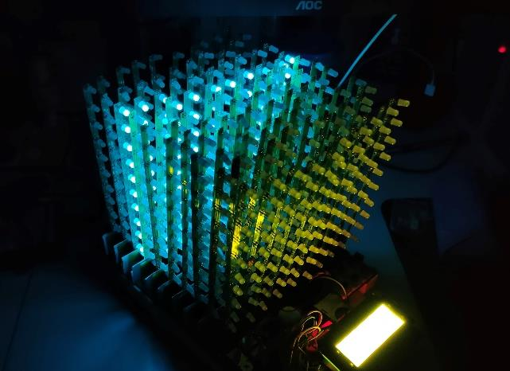

# LED Player

## The Repository
  
This repository is where I record my first attempt at system design. This project uses the scanning 3D display technology based on the translation flat screen to design a light cube with a PC animation editor and an Android App controller, which can be used to provide 3D visual experience. The light cube can be connected to a computer through a USB port, and the computer software can control the cube to play animations.  It can also be connected to the mobile phone through the Wi-Fi module and controlled by the mobile APP software.  It can also collect the external sound from the onboard microphone, or input the sound signal from the audio interface, and display the music spectrum by the light cube.

## App
Developed an Android program using Java to control the player.

## Editor
Developed a PC-side animation editor using Java  to realize frame editing of 3-D animation.

## Hardware
• Used EasyEDA to design the PCB for the LED lights.  
• Used C++ to complete functionalities of SoC serial communication, WiFi communication, LCD liquid crystal display menu, ADC keyboard keys, 128-point FFT, lamp brightness control etc. 

## Using
This project was my first system development work, and the hardware was also developed by myself. If you want to fully experience the project, you can contact me (fablerr@163.com) to get the PCB design drawing and contact the production yourself. On top of that, you'll need to solder 1,000 LED bulbs and countless latches. But it's much easier when you have the hardware, you can download the software parts, I mean the App controller and the PC editor, and you can use them directly.

